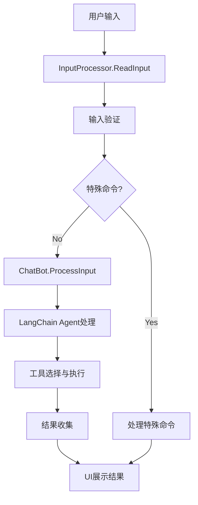
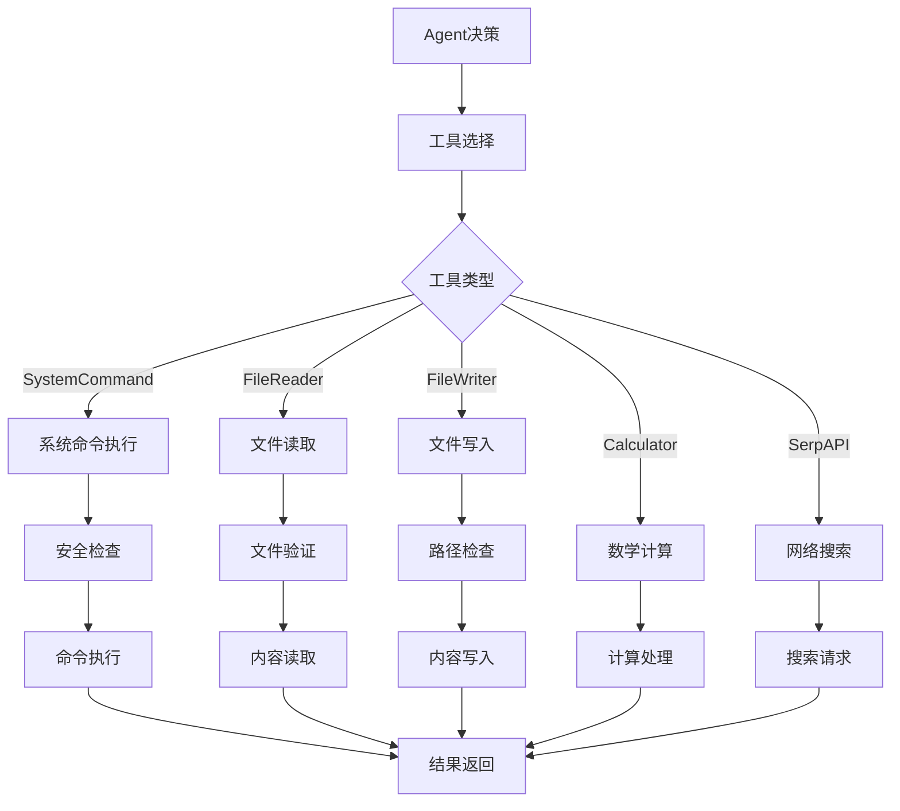

# aishell 项目设计文档

## 项目概述

aishell 是一个基于 Go 语言和 LangChain 的智能终端助手，集成 OpenAI GPT 模型，具备记忆功能和多种实用工具，让命令行操作变得更加智能和高效。

### 核心特性

- **智能对话**: 基于 OpenAI GPT 的自然语言交互，支持上下文记忆
- **多工具集成**: 系统命令、文件操作、数学计算、网络搜索等
- **跨平台支持**: 支持 Linux、macOS、Windows 系统
- **安全机制**: 危险命令确认，路径遍历防护
- **用户体验优化**: 智能补全、历史记录、彩色输出

## 技术架构

### 整体架构图

```
┌─────────────────────────────────────────────────────────────┐
│                      用户交互层                                │
│  ┌─────────────────┐  ┌─────────────────┐  ┌─────────────────┐ │
│  │   Terminal UI   │  │   Completer     │  │   History       │ │
│  │   (welcome.go)  │  │   (completer.go)│  │   (history.go)  │ │
│  └─────────────────┘  └─────────────────┘  └─────────────────┘ │
└─────────────────────────────────────────────────────────────┘
                                │
                                ▼
┌─────────────────────────────────────────────────────────────┐
│                    命令行接口层                               │
│  ┌─────────────────┐  ┌─────────────────┐                    │
│  │     Runner      │  │  InputProcessor │                    │
│  │   (runner.go)   │  │   (input.go)    │                    │
│  └─────────────────┘  └─────────────────┘                    │
└─────────────────────────────────────────────────────────────┘
                                │
                                ▼
┌─────────────────────────────────────────────────────────────┐
│                      应用核心层                               │
│  ┌─────────────────┐  ┌─────────────────┐                    │
│  │    ChatBot      │  │     Config      │                    │
│  │   (chatbot.go)  │  │   (config.go)   │                    │
│  └─────────────────┘  └─────────────────┘                    │
└─────────────────────────────────────────────────────────────┘
                                │
                                ▼
┌─────────────────────────────────────────────────────────────┐
│                      工具执行层                               │
│ ┌──────────────┐ ┌──────────────┐ ┌──────────────┐ ┌────────┐ │
│ │SystemCommand │ │ FileReader   │ │ FileWriter   │ │Calculator│ │
│ │    Tool      │ │    Tool      │ │    Tool      │ │   Tool   │ │
│ └──────────────┘ └──────────────┘ └──────────────┘ └────────┘ │
│ ┌──────────────┐ ┌──────────────┐                             │
│ │   SerpAPI    │ │  Custom Tool │                             │
│ │    Tool      │ │   Support    │                             │
│ └──────────────┘ └──────────────┘                             │
└─────────────────────────────────────────────────────────────┘
                                │
                                ▼
┌─────────────────────────────────────────────────────────────┐
│                    基础设施层                                 │
│  ┌─────────────────┐  ┌─────────────────┐                    │
│  │  SystemPrompt   │  │  Environment    │                    │
│  │ (system_prompt) │  │ (environment.go)│                    │
│  └─────────────────┘  └─────────────────┘                    │
└─────────────────────────────────────────────────────────────┘
```

### 技术栈

| 组件 | 技术选型 | 版本要求 | 用途 |
|------|----------|----------|------|
| 编程语言 | Go | 1.24+ | 主要开发语言 |
| AI框架 | LangChain Go | v0.1.13 | AI Agent 框架 |
| 语言模型 | OpenAI GPT | API | 自然语言处理 |
| 命令行交互 | readline | latest | 交互式输入处理 |
| 颜色输出 | fatih/color | v1.17.0 | 终端彩色输出 |
| 搜索API | SerpAPI | optional | 网络搜索功能 |
| 自定义端点 | OpenAI BaseURL | optional | 支持Azure OpenAI等自定义端点 |

### 设计模式

#### 1. 依赖注入模式
```go
// 在 NewRunner 中注入依赖
func NewRunner(ctx context.Context, config *app.Config) (*Runner, error) {
    chatBot, err := app.NewChatBot(ctx, config)
    // ...
    return &Runner{
        chatBot: chatBot,
        config:  config,
        // ...
    }, nil
}
```

#### 2. 工厂模式
```go
// 工具创建工厂方法
func createToolsList(config *Config) []tools.Tool {
    toolsList := []tools.Tool{
        tools.Calculator{},
        localtools.NewSystemCommand(),
        localtools.NewFileReader(),
        localtools.NewFileWriter(),
    }
    return toolsList
}
```

#### 3. 策略模式
```go
// 不同工具实现统一接口
type Tool interface {
    Name() string
    Description() string
    Call(ctx context.Context, input string) (string, error)
}
```

#### 4. 适配器模式
```go
// 跨平台命令执行适配
func (s *SystemCommand) Call(ctx context.Context, input string) (string, error) {
    var cmd *exec.Cmd
    switch runtime.GOOS {
    case "windows":
        cmd = exec.CommandContext(ctx, "cmd", "/c", command)
    default:
        cmd = exec.CommandContext(ctx, "sh", "-c", command)
    }
    // ...
}
```

## 模块详细设计

### 1. 应用入口模块 (`cmd/aishell/main.go`)

**职责**: 
- 应用程序启动入口
- 版本信息处理
- 帮助信息展示
- 全局初始化

**关键功能**:
```go
func main() {
    ctx := context.Background()
    config := app.LoadConfig()
    runner, err := cli.NewRunner(ctx, config)
    if err != nil {
        log.Fatal("初始化应用失败:", err)
    }
    if err := runner.Run(); err != nil {
        log.Fatal("运行应用失败:", err)
    }
}
```

### 2. 应用核心层 (`pkg/app/`)

#### 2.1 ChatBot (`chatbot.go`)
**职责**: 
- AI 对话逻辑管理
- LangChain Agent 封装
- 工具链集成

**核心数据结构**:
```go
type ChatBot struct {
    executor *agents.Executor    // LangChain 执行器
    llm      llms.Model         // 语言模型
    ctx      context.Context    // 上下文
    config   *Config           // 配置信息
}
```

**关键特性**:
- 对话窗口缓冲内存 (保持最近100轮对话)
- 工具自动选择和执行
- 错误恢复机制

#### 2.2 Config (`config.go`)
**职责**:
- 应用配置管理
- 环境变量处理
- 默认值设置
- 自定义端点配置

**配置项**:
```go
type Config struct {
    ConversationBufferSize int    // 对话缓冲大小
    MaxExecutorIterations  int    // 最大迭代次数
    HistoryFile           string // 历史文件路径
    Prompt                string // 命令行提示符
    DebugMode             bool   // 调试模式
    HasSearchAPI          bool   // 搜索API可用性
    OpenAIBaseURL         string // OpenAI自定义端点
}
```

**自定义端点支持**:
```go
// 支持Azure OpenAI、代理服务等自定义端点
if config.OpenAIBaseURL != "" {
    llm, err = openai.New(
        openai.WithBaseURL(config.OpenAIBaseURL),
    )
}
```
```

### 3. CLI 交互层 (`pkg/cli/`)

#### 3.1 Runner (`runner.go`)
**职责**: 
- CLI 应用主循环
- 用户输入处理
- 特殊命令识别

**主循环逻辑**:
1. 读取用户输入
2. 输入验证和预处理
3. 特殊命令处理 (exit, help, history, clear)
4. 调用 ChatBot 处理普通输入
5. 结果展示和错误处理

#### 3.2 InputProcessor (`input.go`)
**职责**: 
- 输入读取和清理
- 输入验证
- 命令类型识别

### 4. 工具执行层 (`pkg/tools/`)

#### 4.1 SystemCommand (`system_command.go`)
**职责**: 跨平台系统命令执行

**安全特性**:
- 危险命令列表维护
- 用户确认机制
- 执行超时控制
- 命令输出安全处理

**危险命令管理**:
```go
DangerousCommands: []string{
    "rm", "del", "erase", "rmdir",       // 删除命令
    "shutdown", "reboot", "halt",        // 系统控制
    "dd", "fdisk", "mkfs", "format",     // 磁盘操作
    "chmod", "chown", "chgrp",           // 权限修改
    // ...
}
```

#### 4.2 FileReader (`file_reader.go`)
**职责**: 安全的文件读取操作

**功能特性**:
- 按行号范围读取
- 相对/绝对路径支持
- 文件存在性检查
- 格式化输出 (行号|内容)

#### 4.3 FileWriter (`file_writer.go`)
**职责**: 安全的文件写入操作

**安全机制**:
- 路径遍历攻击防护
- 文件类型白名单
- 目录自动创建选项
- JSON/简单格式双重解析

**支持的文件类型**:
```go
textExtensions := []string{
    ".txt", ".log", ".md", ".json", ".xml", ".yaml", ".yml",
    ".go", ".py", ".js", ".html", ".css", ".sql", ".sh", ".bat",
    ".c", ".cpp", ".h", ".java", ".php", ".rb", ".rs", ".swift",
    ".conf", ".config", ".ini", ".env", ".properties",
}
```

### 5. UI 用户界面层 (`pkg/ui/`)

#### 5.1 Welcome (`welcome.go`)
**职责**: 
- 欢迎信息展示
- 环境状态检查
- 帮助信息显示
- 用户交互提示

**界面特性**:
- 彩色输出支持
- 环境配置状态提示
- 分类功能介绍
- 使用技巧展示

#### 5.2 Completer (`completer.go`)
**职责**: 智能自动补全功能

**补全类别**:
- 系统管理命令
- 文件操作命令  
- 计算分析命令
- 搜索功能命令
- 诊断功能命令
- 控制命令

### 6. 基础设施层

#### 6.1 SystemPrompt (`pkg/prompt/system_prompt.go`)
**职责**: 系统提示词生成

**动态信息包含**:
- 当前操作系统和架构
- 当前工作目录
- 系统时间
- 可用工具列表

#### 6.2 Environment (`pkg/utils/environment.go`)
**职责**: 环境信息获取

## 数据流设计

### 用户输入处理流程



### 工具执行流程



## 安全设计

### 1. 命令执行安全
- **危险命令识别**: 维护危险命令白名单
- **用户确认机制**: 危险操作需要用户明确确认
- **执行超时**: 防止命令长时间阻塞
- **输出过滤**: 防止恶意输出注入

### 2. 文件操作安全
- **路径遍历防护**: 禁用 `..` 相对路径符号
- **文件类型限制**: 只允许文本文件写入
- **权限控制**: 使用合理的文件权限 (0644, 0755)

### 3. 输入验证
- **长度限制**: 输入内容长度检查
- **格式验证**: JSON 参数格式验证
- **字符过滤**: 特殊字符处理

## 性能设计

### 1. 内存管理
- **对话缓冲窗口**: 限制内存中保持的对话轮数 (默认100轮)
- **工具实例复用**: 避免重复创建工具实例
- **适时垃圾回收**: 合理的对象生命周期管理

### 2. 并发处理
- **上下文传递**: 使用 Context 进行超时和取消控制
- **异步执行**: 支持后台任务执行
- **资源锁定**: 避免文件操作竞态条件

### 3. 响应优化
- **智能缓存**: 重复查询结果缓存
- **批量操作**: 支持批量文件操作
- **渐进式加载**: 大文件分段读取

## 扩展性设计

### 1. 工具扩展
```go
// 新工具只需实现 Tool 接口
type CustomTool struct {
    // 自定义字段
}

func (c *CustomTool) Name() string {
    return "custom_tool"
}

func (c *CustomTool) Description() string {
    return "自定义工具描述"
}

func (c *CustomTool) Call(ctx context.Context, input string) (string, error) {
    // 自定义逻辑实现
    return result, nil
}
```

### 2. UI 扩展
- 可插拔的 UI 组件
- 自定义颜色主题
- 可配置的提示符和输出格式

### 3. 配置扩展
- 支持配置文件加载
- 环境变量优先级
- 运行时配置热更新

## 错误处理策略

### 1. 分层错误处理
- **工具层**: 返回详细错误信息
- **应用层**: 错误分类和恢复
- **界面层**: 用户友好的错误显示

### 2. 错误类型设计
```go
type InputError struct {
    message string
}

func (e *InputError) Error() string {
    return e.message
}
```

### 3. 恢复机制
- **自动重试**: 网络请求等可重试操作
- **降级处理**: 功能不可用时的备选方案
- **状态保护**: 确保错误不影响整体系统稳定性

## 测试策略

### 1. 单元测试
- **工具测试**: 每个工具的独立测试
- **配置测试**: 配置加载和验证测试
- **输入处理测试**: 各种输入场景的测试

### 2. 集成测试
- **端到端测试**: 完整用户交互流程测试
- **跨平台测试**: 不同操作系统的兼容性测试

### 3. 性能测试
- **负载测试**: 大量请求的处理能力
- **内存测试**: 长时间运行的内存占用
- **并发测试**: 并发操作的安全性

## 构建和部署

### 1. 构建系统
- **Makefile**: 标准化的构建流程
- **版本注入**: 构建时版本信息注入
- **多模式构建**: 开发/发布模式支持

### 2. 打包分发
- **二进制分发**: 单一可执行文件
- **安装脚本**: 自动化安装流程
- **Docker支持**: 容器化部署选项

### 3. CI/CD
- **自动测试**: 代码提交自动触发测试
- **构建检查**: 代码质量和安全扫描
- **发布流程**: 自动化版本发布

## 监控和诊断

### 1. 日志系统
- **分级日志**: DEBUG/INFO/WARN/ERROR
- **结构化日志**: JSON 格式的日志输出
- **日志轮转**: 防止日志文件过大

### 2. 调试支持
- **调试模式**: `AISHELL_DEBUG=true` 详细日志
- **性能分析**: Go pprof 集成
- **错误追踪**: 详细的错误堆栈信息

### 3. 健康检查
- **依赖检查**: OpenAI API 可用性检测
- **资源监控**: 内存和CPU使用情况
- **功能验证**: 核心功能可用性检查

## 总结

aishell 项目采用了现代 Go 应用的最佳实践，通过分层架构、依赖注入、接口抽象等设计模式，实现了高度模块化、可扩展、安全可靠的智能终端助手。项目结构清晰，代码质量高，具备良好的测试覆盖率和文档完整性，为后续的功能扩展和维护提供了坚实的技术基础。
